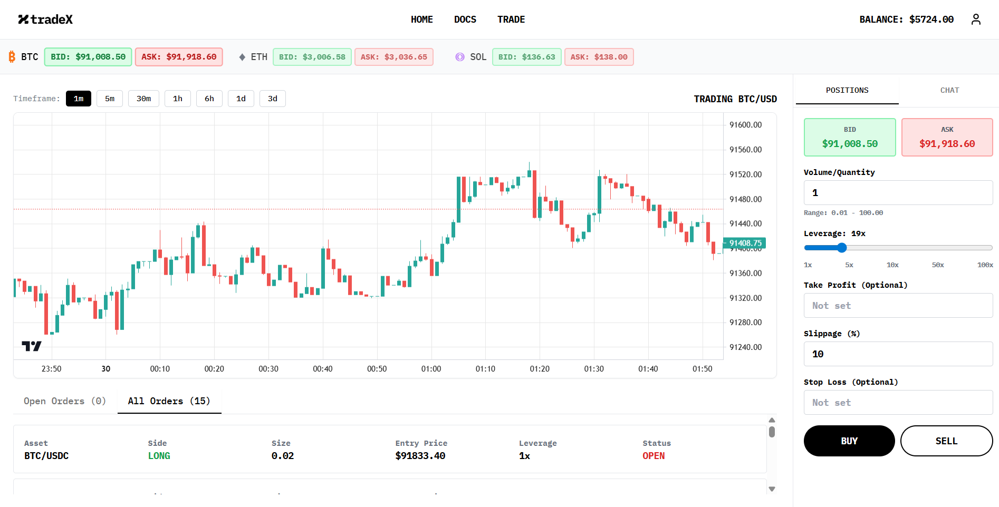
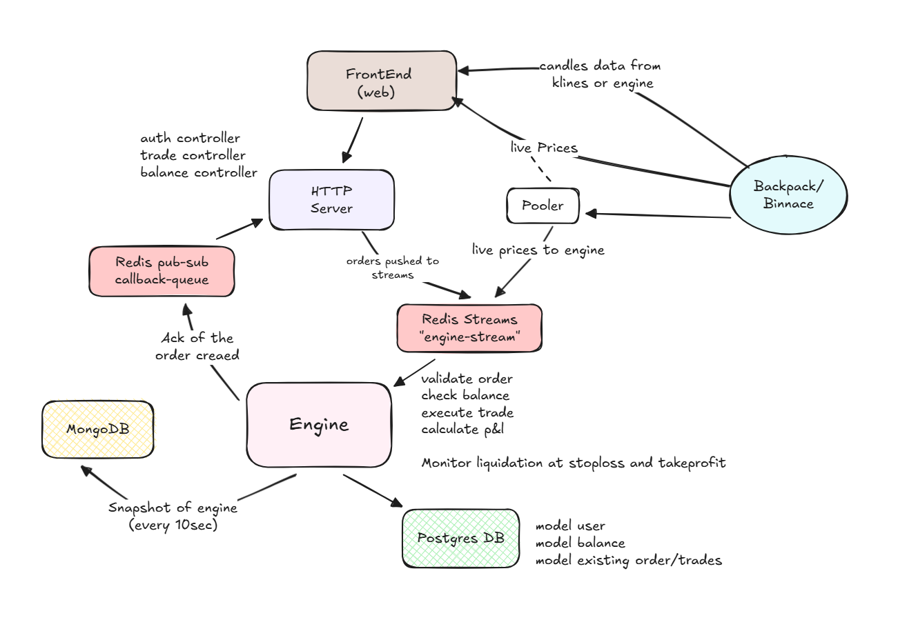

# 🚀 BullTrade – Cryptocurrency Trading Platform

BullTrade is a **full-stack, real-time cryptocurrency trading simulation platform** that mirrors the architecture of a professional margin-trading terminal.

It combines **live market feeds**, a **stream-driven matching engine**, and a **modern trading UI** to demonstrate how high-frequency trading systems are designed, coordinated, and replayed in production-grade environments.



---

## 🧭 What Does BullTrade Do?

BullTrade simulates a live crypto trading experience where users can:

- 📡 View real-time **BTC / ETH / SOL** prices via WebSocket
- 📈 Place **LONG / SHORT** trades with up to **100× leverage**
- 💰 Monitor positions with **live P&L updates**
- 🕯️ View interactive **candlestick charts** across multiple timeframes
- 📜 Track trading history and wallet balance

> ⚠️ BullTrade is a **simulation platform** intended for learning and system design exploration — not real trading.

---

## 🏗️ System Overview

BullTrade is a **Turborepo-powered mono-repo** designed to resemble a real crypto exchange stack.

It combines:
- A **Bun-powered trading engine**
- An **Express REST API**
- A **Vite + React trading terminal**
- **Redis Streams** for command & price propagation
- **MongoDB snapshots** for deterministic replay

---

## 🏛️ Architecture Diagram

The diagram below illustrates BullTrade’s **event-driven trading architecture**, showing how live market data, user commands, and engine acknowledgements flow through the system.




### Key Architectural Concepts

- **Market Data Ingestion**
  - `apps/pooler` consumes live price feeds from Backpack Exchange
  - Prices are batched and written to Redis Streams for deterministic consumption

- **Command-driven Trading Engine**
  - User trade actions are written as commands to Redis Streams
  - `apps/engine` consumes commands sequentially, ensuring order consistency
  - Engine state is held in-memory for speed and snapshotted to MongoDB

- **API ↔ Engine Coordination**
  - The API waits for engine acknowledgements via Redis Pub/Sub
  - Timeouts and engine errors propagate cleanly back to the UI

- **Dual Price Feeds**
  - UI subscribes directly to Backpack for instant price rendering
  - Engine uses Redis-streamed prices for execution correctness

---

## ✨ Highlights

| Area | Details |
| --- | --- |
| **Assets** | BTC / ETH / SOL perpetual-style pairs with configurable leverage (1–100×). |
| **Live prices** | `apps/pooler` streams Backpack Exchange tickers into Redis Streams. The UI also subscribes directly to Backpack for ultra-low-latency rendering. |
| **Trading engine** | `apps/engine` consumes Redis Streams, maintains an in-memory order & balance model, snapshots to MongoDB every 15 s, and replays the stream on restart. |
| **API surface** | `apps/api` exposes authenticated REST endpoints and bridges client commands to the engine using Redis Streams + Pub/Sub acknowledgements. |
| **Front-end** | `apps/web` (Vite + React + Tailwind) renders the trading terminal, real-time charts, and order controls. |
| **Shared packages** | Typed Redis helpers, Prisma schemas, and shared UI components via `packages/*`. |
| **Tooling** | Bun 1.2+, Node 20+, Turbo build graph, Docker-based local infra. |

---

## 🧠 Why This Architecture?

**Why Redis Streams?**
- Ordered, replayable event log
- Natural fit for command → execution pipelines
- Enables deterministic recovery after crashes

**Why in-memory engine + snapshots?**
- Fast execution & P&L updates
- MongoDB snapshots allow:
  - Engine restarts
  - Historical inspection
  - Stream replay without recomputation

**Why dual price feeds?**
- UI subscribes directly to Backpack for instant rendering
- Engine consumes Redis for deterministic pricing during execution

This separation mirrors real exchange architectures.

---
## 📁 Repository Layout

```
exness-v3/
├── apps/
│   ├── api/              # Express REST API (JWT auth, Prisma, Redis)
│   ├── engine/           # Bun-based trading engine + MongoDB snapshots
│   ├── pooler/           # Backpack WebSocket → Redis price streamer
│   └── web/              # Vite + React trading UI
├── packages/
│   ├── db/               # Prisma schema & database client
│   ├── redis/            # Typed Redis clients & stream helpers
│   ├── ui/               # Shared Tailwind / shadcn UI components
│   └── eslint-config/    # Shared ESLint configuration
├── docker-compose.yaml   # Local infra (DBs, Redis, services)
├── turbo.json            # Turborepo pipeline configuration
└── package.json          # Root workspace configuration

```

ℹ️ The earlier standalone WebSocket broadcaster has been merged into the API.
The UI currently consumes Backpack prices directly for latency reasons.

---

## 🔁 Architecture Flows

### Price Flow
1. `apps/pooler` connects to `wss://ws.backpack.exchange/`
2. Deduplicated ticks are batched and appended to `stream:engine`
3. The engine consumes the stream to keep its price cache in sync
4. The UI maintains its own WebSocket feed for immediate updates

### Trading Flow
1. UI calls `/api/v1/*` endpoints
2. API writes commands to Redis Streams with a `requestId`
3. Engine processes the command and updates in-memory state
4. Engine publishes acknowledgements via Redis Pub/Sub
5. API returns the result or timeout error to the client

---

## 🧰 Tech Stack

**Frontend**
- React 18, TypeScript, Vite
- TailwindCSS, shadcn/ui
- React Query, React Router
- Lightweight Charts

**Backend**
- Node.js 20+, Express 5
- Prisma ORM, PostgreSQL 16
- JWT / bcrypt authentication

**Engine & Infra**
- Bun runtime
- Redis 7 (Streams + Pub/Sub)
- MongoDB 6 (engine snapshots)
- Docker Compose

---

## 🚀 Getting Started

### Prerequisites
- Node.js ≥ 20
- Bun ≥ 1.0
- Docker (recommended)

### Install & Run

```bash
# Clone the repository
git clone https://github.com/Ganji-Sandeep-10/BullTrade.git
cd exness-v3

# Install dependencies
bun install

# Start infrastructure (Postgres, Redis, Mongo)
docker compose up -d

# Run services (each in a separate terminal)
cd apps/pooler && bun run dev
cd apps/engine && bun run dev
cd apps/api && npm run dev
cd apps/web && bun run dev
```

---
## ⚠️ Non-Goals & Disclaimer

- ❌ No real funds or live trading
- ❌ Not production-hardened for security
- ❌ No regulatory compliance guarantees

BullTrade is intended for **learning, experimentation, and architectural exploration**.

---

## 📄 License

MIT

---

**Ganji Sandeep**  
GitHub: [@Ganji-Sandeep-10](https://github.com/Ganji-Sandeep-10)


